## Pitt Database Management (INFSCI 2710) final project

- **Requirement:**

  You will create a catalog of products (5-10) that your company provides. Your system must maintain a record of customers and the products that each customer owns. As each product is purchased by a customer, the database should be updated to reflect what they own. You must keep track of customers, including their personal information, and purchase history. You should keep track of employees that work at your company. These employees will be the users of your software. They will open cases to support your products and see them through to resolutions.

# Database System for Customer Support

### ER Diagram:

  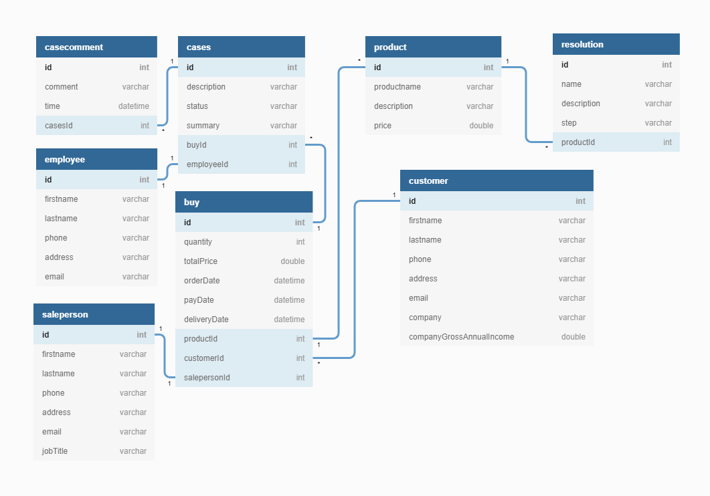

### Tools & Team Members:

- **Backend:**
  
  - Tools: Spring Boot, PostgreSQL
  - PIC: Yen-Ming (Ellee) Chen, I-Ling Yeh

- **Frontend:**
  
  - Tools: Angular, Angular Material
  - PIC: Shuo-Yuan (Antonio) Chang, Yuke Liu

### App Preview:

- **Customer List**

  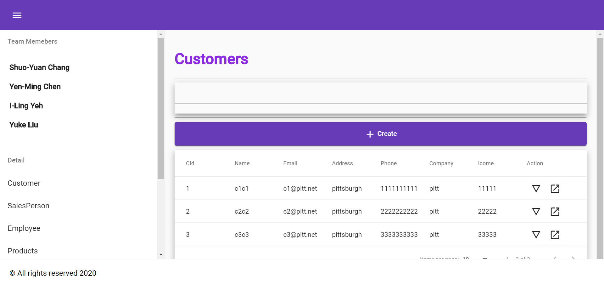

- **Add New Customer**

  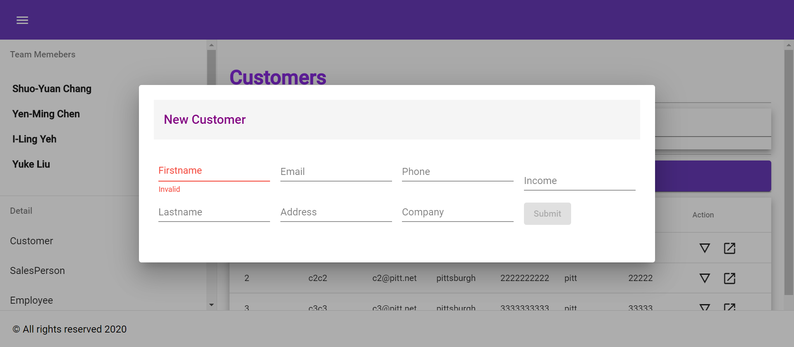

- **Edit One Customer**

  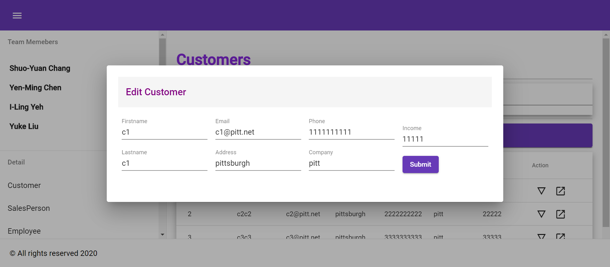

- **Lookup One Customer**

  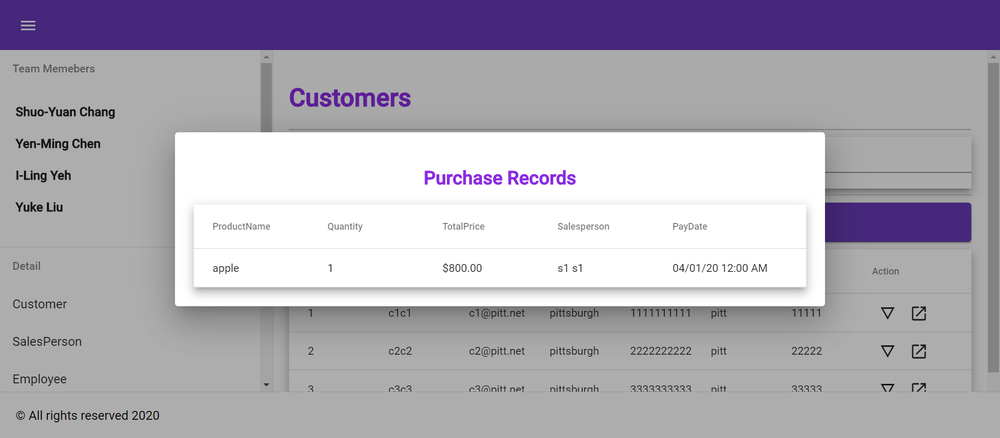

- **Salesperson List**

  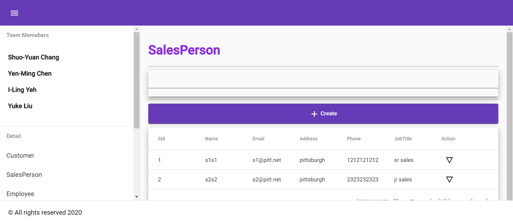

- **Add New Salesperson**

  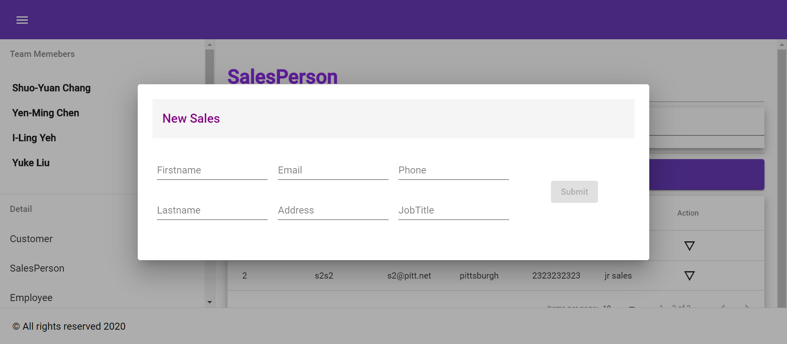

- **Lookup One Salesperson**

  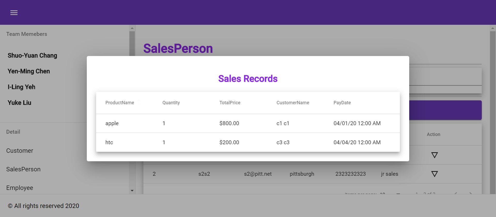

- **Employee List**

  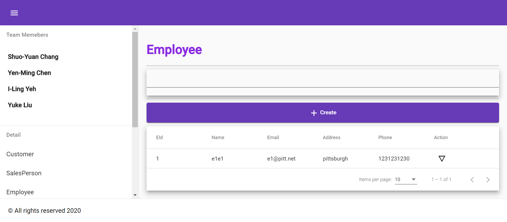

- **Add New Employee**

  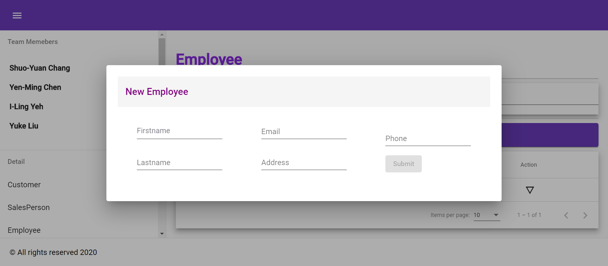

- **Lookup One Employee**

  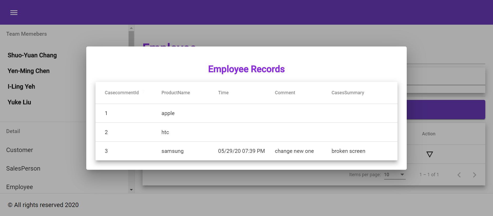

- **Product List**

  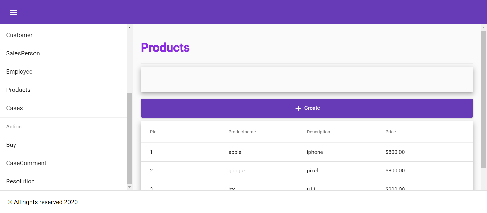

- **Add New Product**

  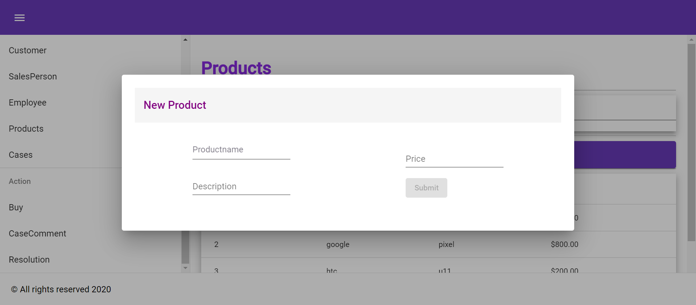

- **Case List**

  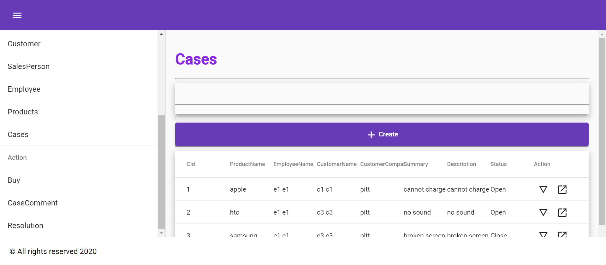

- **Add New Case**

  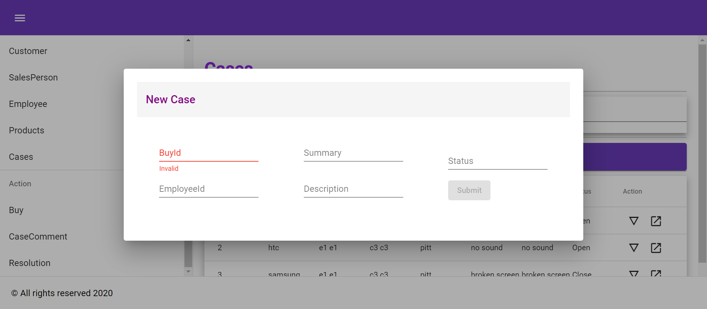

- **Edit One Case**

  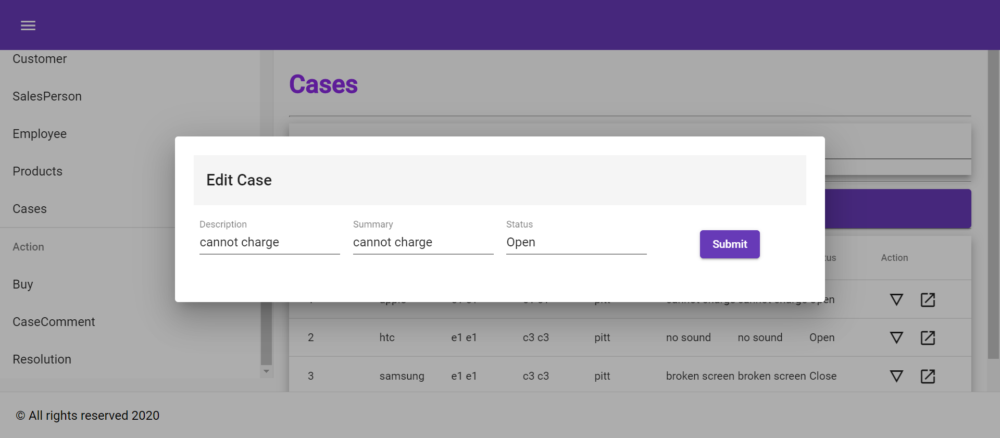

- **Lookup One Case**

  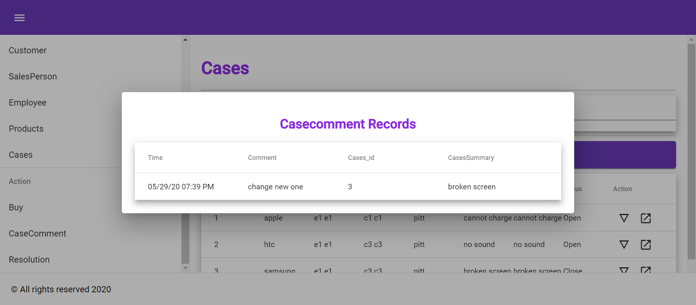

- **Buy List**

  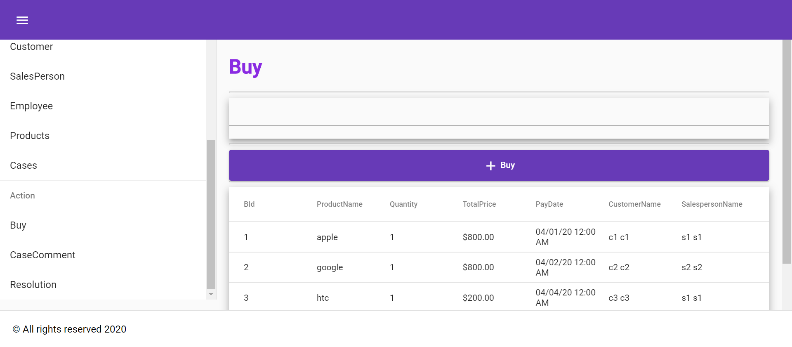

- **Add New Buy**

  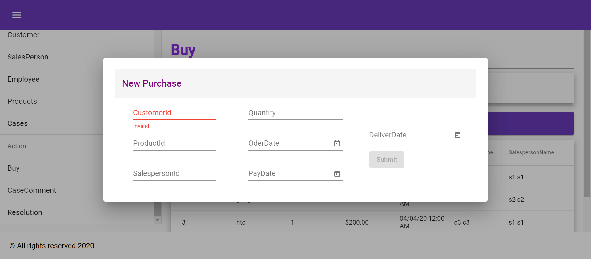

- **Case Comment List**

  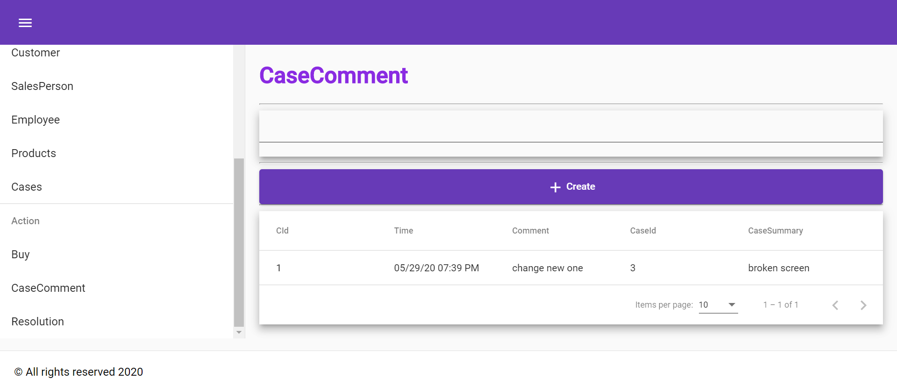

- **Add New Case Comment**

  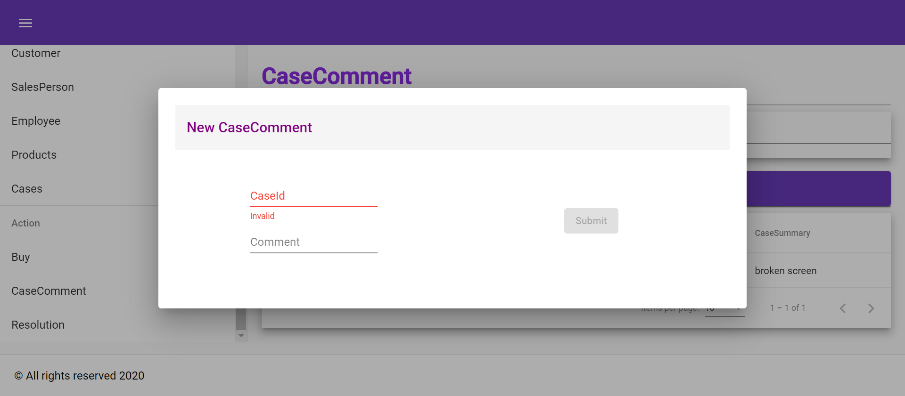

- **Resolution List**

  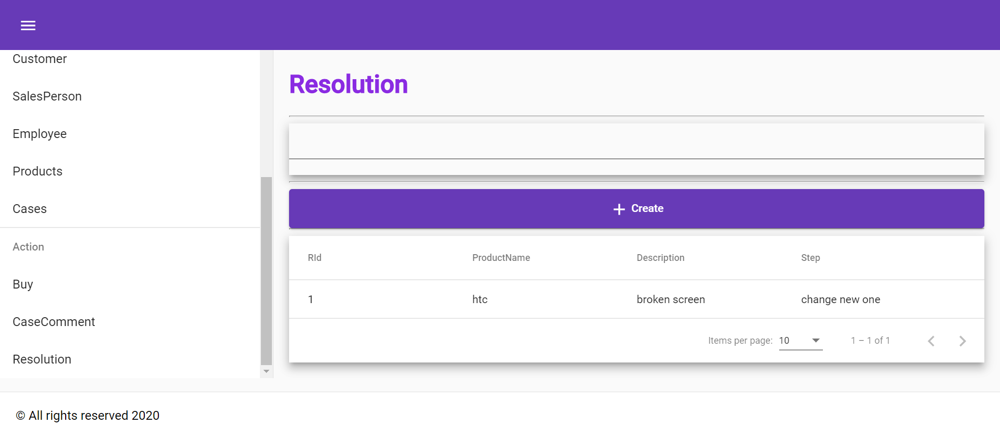

- **Add New Resolution**

  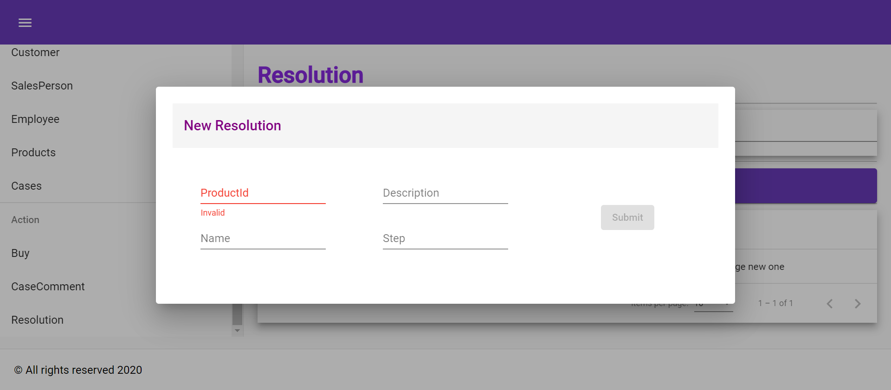
